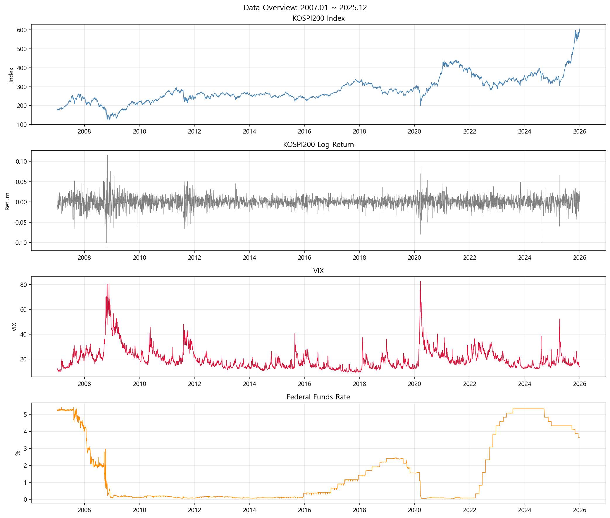
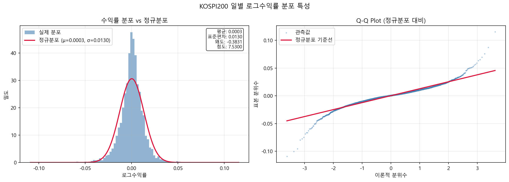
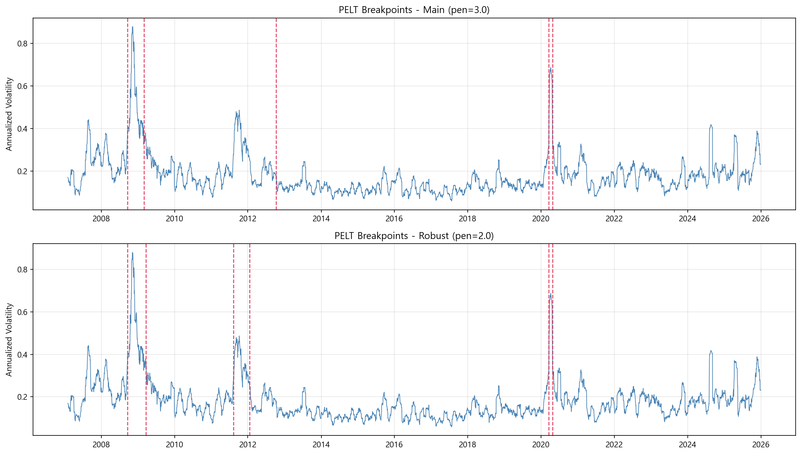
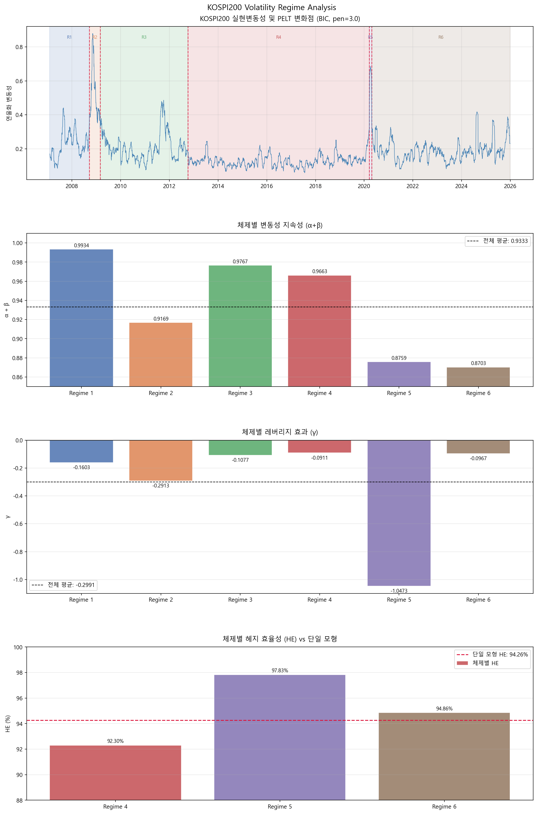

# KOSPI200 변동성 체제 분석 및 동태적 헤지 전략

## 개요
2007년 1월부터 2025년 12월까지의 KOSPI200 일별 데이터를 활용하여,  
미국 통화정책 불확실성(VIX·연방기금금리)이 KOSPI200 변동성 체제 전환을 유발하며  
체제별 최적 헤지비율이 단일 모형 대비 유의미하게 다름을 실증하였다.

## 분석 단계
1. **그랜저 인과성 검정** (VAR, BIC 기준 lag=4)
2. **PELT 변화점 탐지** (BIC 기준 페널티=3.0, AIC 강건성 검증)
3. **체제별 GARCH/EGARCH 추정** (레버리지 효과, 변동성 지속성)
4. **체제별 최소분산 헤지비율 및 HE 산출**

## 주요 결과
| 분석 | 결과 |
|------|------|
| VIX → KOSPI200 변동성 | lag 1~4 전 구간 유의 (F최대 162.30) |
| PELT 변화점 | 5개 식별, 주요 통화정책 이벤트와 일치 |
| 레버리지 효과 | 전 체제 γ < 0, Regime 5에서 γ = −0.719 극대화 |
| 헤지 효율성 | Regime 5: 97.83% vs 단일 모형: 94.26% |

## 주요 결과 시각화

### 데이터 개요 (2007.01 ~ 2025.12)


### 수익률 분포 특성


### PELT 변화점 탐지 결과


### 체제별 분석 결과


## 데이터
직접 다운로드 후 `data/` 폴더에 저장 필요.

| 파일명 | 출처 | 경로 |
|--------|------|------|
| `vix_raw.csv` | FRED | https://fred.stlouisfed.org/series/VIXCLS |
| `ffr_raw.csv` | FRED | https://fred.stlouisfed.org/series/DFF |
| `kospi200_futures_raw.csv` | Investing.com | KOSPI200 선물 히스토리 데이터 |

> KOSPI200 데이터는 코드 내 yfinance로 자동 수집됩니다.

## 실행 방법
```bash
# 1. 패키지 설치
pip install -r requirements.txt

# 2. data/ 폴더에 데이터 파일 저장 후 실행
python analysis.py
```

## 환경
- Python 3.11
- Windows 10/11
- Anaconda 권장

## 참고문헌
- Engle (1982), Bollerslev (1986), Nelson (1991)
- Killick et al. (2012), Yao (1988)
- Schwert (1989), Granger (1969), Ederington (1979)

## 향후 계획
SDAR 기반 실시간 변화점 탐지 + VIX 선행 지표 결합  
동태적 헤지 알고리즘으로 확장 예정 (별도 프로젝트)
